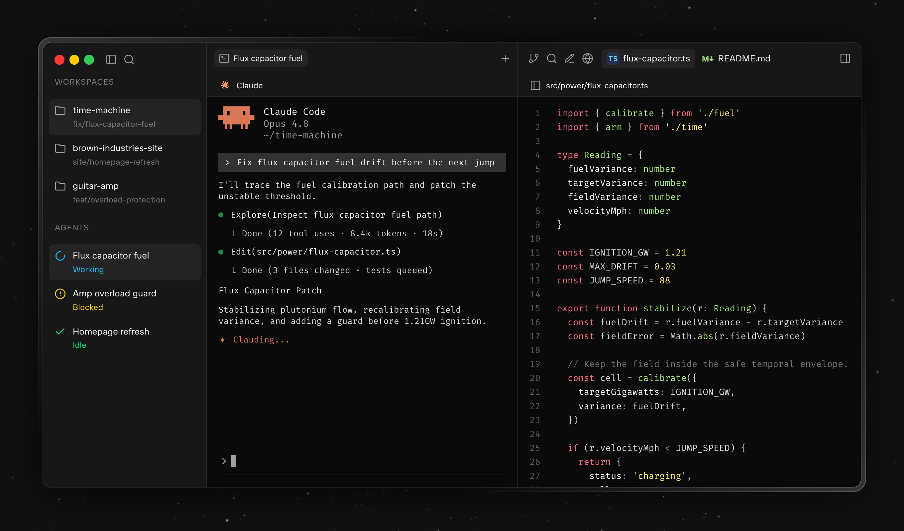

<picture>
  <source media="(prefers-color-scheme: dark)" srcset="src/assets/logo.svg" />
  <source media="(prefers-color-scheme: light)" srcset="src/assets/logo-light.svg" />
  
</picture>

 

### An open-source IDE for your coding agents

 

 

[**Download for macOS**](https://github.com/verne-build/verne/releases/latest) &nbsp;&bull;&nbsp; [**Website**](https://verne.build) &nbsp;&bull;&nbsp; [**Docs**](https://verne.build/docs) &nbsp;&bull;&nbsp; [**Changelog**](https://verne.build/changelog)

## Why Verne

Your agents run in a terminal. The files they touch, the diffs you review, the browser you verify in, and the context they need all live in other windows. Verne puts the agents at the centre and brings the rest in with them.

- **Your agents, your accounts.** Verne runs the CLI agents you installed, signed in with your own accounts. On a Claude Pro or Max plan? Verne keeps using it, no API key and no extra billing.
- **Your code stays on your machine.** Verne runs locally and talks only to the agents you installed. Your code and prompts never reach our servers.
- **Free and open-source.** GPLv3. Download it, use it, fork it. No account, no licence key, nothing paywalled.

## Bring your favourite agents

[Claude Code](https://www.anthropic.com/claude-code) · [Codex](https://openai.com/codex/) · [Cursor](https://cursor.com) · [OpenCode](https://opencode.ai) · [Antigravity](https://antigravity.google)

Any CLI agent runs in a Verne terminal; the ones above also show their live status.

## Features

| Feature | What it does |
| --- | --- |
| **Monitor every agent at a glance** | Each terminal carries a live status dot. Verne reads the running agent and tells you when it's working, waiting on you, or done, so a stalled session never hides in a background tab. |
| **Pick up where you left off** | A detached daemon owns the PTYs, so terminals and agents outlive the app. Quit, reboot, or drop your connection, then reopen and reattach to sessions still running. |
| **A familiar editor, built in** | Open files in tabs and edit them in-app on Monaco, the engine behind VS Code, backed by LSP for go-to-definition and diagnostics. Your themes and keybindings come along. |
| **Review every change before you commit** | Watch files change as your agents write them, open a line-by-line diff for any one, then stage and commit from the same window. |
| **A browser your agents can drive** | Real browser tabs sit beside your code for previewing work. Hand one to an agent over MCP and it can navigate, fill forms, and read the page mid-task. |
| **Notes your agents can read** | Every workspace gets its own notes, exposed to agents over MCP. Drop the context, conventions, or TODOs they need where the code is, not in a separate doc. |
| **Voice** | On-device speech-to-text via sherpa-onnx, with developer-term and number post-processing. |

## Platforms

macOS today, on both Apple Silicon and Intel. Linux and Windows are on the roadmap. Watch [the repo](https://github.com/verne-build/verne) for releases.

## Licence

Distributed under the GNU General Public Licence 3.0. See [LICENCE.txt](LICENCE.txt) for more information.
